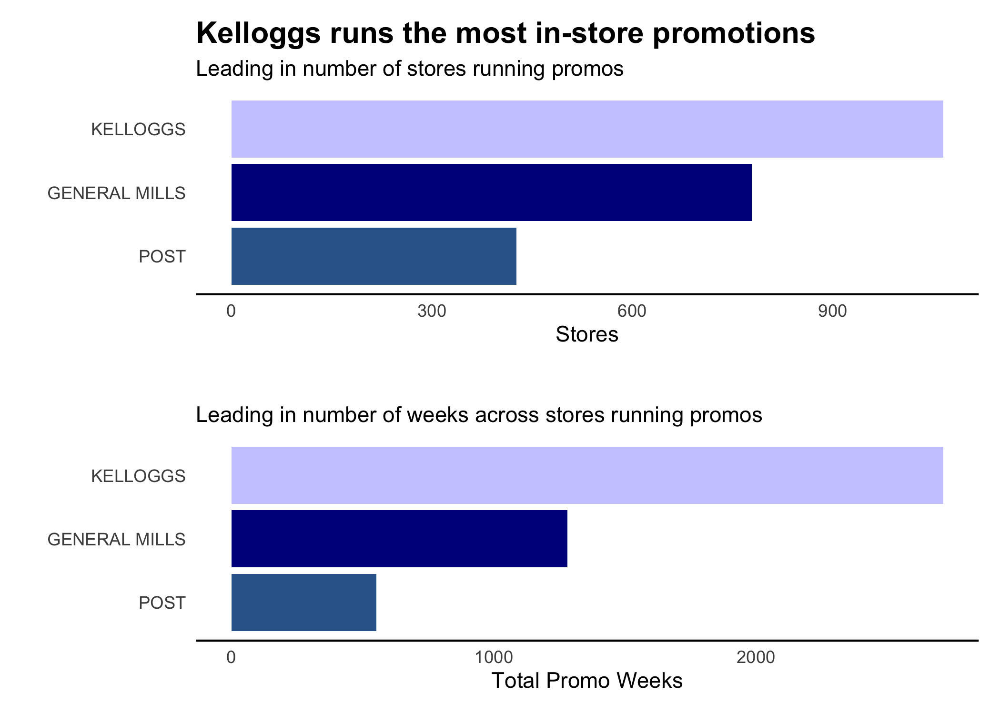
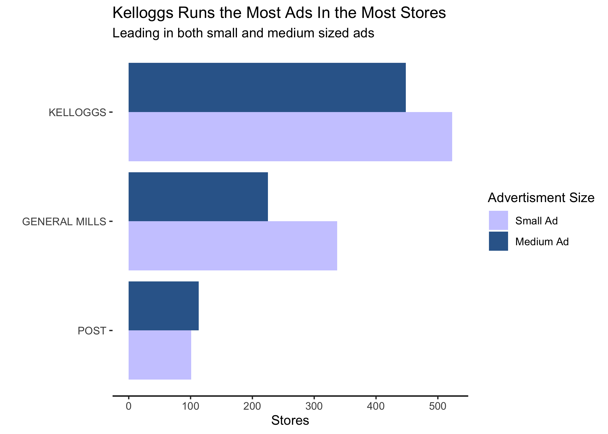

#### **To: Quian Xu**  
  
#### **From: Jennifer Grosz and Josh Wolfe**  
  
#### **Date: 07/29/2021**   
  
#### **RE: General Mills Competitive Marketplace Analysis**  

***

```{r include = FALSE}
# Set chunk options for the file
knitr::opts_chunk$set(echo = FALSE, message = FALSE, warning = FALSE)
options(scipen=999)
```

```{r echo = FALSE}
# Course: 5210 Data Visualization
# Purpose: Memo for Midterm Project
# Date: July 29, 2021
# Author: Jennifer Grosz and Josh Wolfe
```

```{r}
# Load relevant packages used for analyzing General Mills data
library(tidyverse) # contains ggplot2, dplyr, and several other packages used
library(vtable) # contains vtable function for summary table of data
library(janitor) # contains tidyverse functions for cross-tables
library(gridExtra) # contains grid.arrange function used to combine plots in the same window
library(patchwork) # use to put graphs together in the same frame
library(knitr) # contains some table formatting functions
library(kableExtra) # also contains functions used for table outputs
library(GGally) # contains a custom correlation plot 
library(moments) # to calculate skewness
library(scales) # use for rounding numbers
library(corrplot) # for correlation plot
library(tidylog) # provides data set information reports
library(tidyr) # provides uncount function
library(Hmisc)
library(MultinomialCI)
library(htmlTable)
library(colorspace)
```

```{r}
# load product data
product_data <- read.csv("../data/mtp_product_data.csv")

# load sales data
sales_data <- read.csv("../data/mtp_sales_data.csv")
```

```{r}
# Need to mutate UPC values to merge data sets because they're different in each data set. For example:
# 
# - sales_data has UPC as 01.16000.11653
# - product_data has UPC as 00-01-16000-11653

# change UPC to merge data sets
product_data <- product_data %>%
  # start by separating values by -."
  separate("UPC", into = c("first", "second", "third", "fourth"), sep = "-") %>%
  # unite columns to make UPC the same as it is in sales_data
  unite(col = "UPC", c("second", "third", "fourth"), sep = ".") %>%
  # drop column with leading zeros from product_data's UPC
  select(-first)

# Join data sets
gm_joined_data <- right_join(sales_data, product_data, by = "UPC")
```

```{r}
# Create cereal variable
# Reduce brand variable to just brand name

gm_joined_data <- gm_joined_data %>%
  mutate(
    cereal = case_when(
      str_sub(brand, 1,  7) == "GENERAL" ~ str_sub(brand, 15, -1),
      str_sub(brand, 1, 8) == "KELLOGGS" ~ str_sub(brand, 10, -1),
      str_sub(brand, 1, 4) == "POST" ~ str_sub(brand, 6, -1)),
    brand = case_when(
    str_sub(brand, 1,  7) == "GENERAL" ~ "GENERAL MILLS",
    str_sub(brand, 1, 8) == "KELLOGGS" ~ "KELLOGGS",
    str_sub(brand, 1, 4) == "POST" ~ "POST")
  )

gm_only <- subset(gm_joined_data, brand == "GENERAL MILLS")
```

```{r}
# Convert variables to factors
gm_joined_data[,'promo'] <- factor(gm_joined_data[,'promo'])
gm_joined_data[,'ad'] <- factor(gm_joined_data[,'ad'])
gm_joined_data[,'brand'] <- factor(gm_joined_data[,'brand'])
gm_joined_data[,'cereal'] <- factor(gm_joined_data[,'cereal'])
gm_joined_data[,'flavor'] <- factor(gm_joined_data[,'flavor'])
gm_joined_data[,'package'] <- factor(gm_joined_data[,'package'])
gm_joined_data[,'iri_key'] <- factor(gm_joined_data[,'iri_key'])

gm_only[,'promo'] <- factor(gm_only[,'promo'])
gm_only[,'ad'] <- factor(gm_only[,'ad'])
gm_only[,'brand'] <- factor(gm_only[,'brand'])
gm_only[,'cereal'] <- factor(gm_only[,'cereal'])
gm_only[,'flavor'] <- factor(gm_only[,'flavor'])
gm_only[,'package'] <- factor(gm_only[,'package'])
gm_only[,'iri_key'] <- factor(gm_only[,'iri_key'])
```

```{r}
# Create total sales data frame
gm_total_sales <- uncount(gm_joined_data, units)
gm_only <- uncount(gm_only, units)
```

```{r}
# Figures used in memo

a <- gm_joined_data %>%
  filter(promo == 1) %>%
  mutate(promo_price = price)

a <- a %>%
  group_by(brand) %>%
  summarise(average_promo_price = median(price))

b <- gm_joined_data %>%
  filter(promo == 0) %>%
  mutate(non_promo_price = price)

b <- b%>%
  group_by(brand) %>%
  summarise(average_nonpromo_price = median(price)) 

c <- right_join(a, b, by = c("brand"))

c<- c %>%
  group_by(brand) %>%
  mutate("average discount" = dollar(average_nonpromo_price - average_promo_price)) %>%
  select(brand, "average discount")

d <- gm_joined_data %>%
  filter(promo == 1) %>%
  group_by(brand) %>%
  summarise("units sold during \nin-store promotions" = comma(sum(units)))

c <- right_join(c, d, by = c("brand"))

```

In this analysis we examine General Mills cereal product and strategy performance relative to our two main competitors: Kelloggs and Post. The data you provided us with consists of the sales records for 15 different cereals across three brands including the use of promotions and advertisements, weekly sales totals, store information, and the sale price. This sales information is important because these brands are our competitors and consumers are likely looking at all three brand’s products simultaneously when making purchasing decisions. 

We set out on this analysis with the goal of identifying areas of interest in General Mills' performance as it pertains to in-store promotions and advertisements in an effort to make data driven business decisions and increase overall product sales. Using this data, we can assess the effectiveness of General Mills' advertisement and promotion strategies in comparison to our competitors and we’ve come up with some interesting findings to share with you.


 `r  kbl(c) %>% kable_minimal(full_width = F, position = "left") `
 
The table above shows the average promotion discount offered by each brand and the units sold during in store promotions. As you can see, General Mills' promotions offer the largest price discount, yet sell fewer units during in-store promotions than Kelloggs brand. We found this odd and wanted to further investigate what might be driving the higher unit sales for Kelloggs' products despite General Mill's better promotion price. Below is a visualization of what we found.


{width=500px}

Fig 1

As shown in Fig 1, Kelloggs is reliably running promotions in more stores than General Mills and they're running promotions for the largest number of weeks across those stores. Kelloggs is running in-store promotions for almost double the number of weeks that General Mills is currently running promotions.    


{width=500px}

Fig 2

When it comes to in-store advertisements we have found that Kelloggs runs the most overall. Out of both small and medium sized advertisements Kelloggs beats General Mills in placement of both ad sizes in stores by a reliable margin. Kelloggs running more advertisements of all size in both stores and overall count could help explain why Kelloggs also leads in overall sales. It follows that General Mills sits between Kelloggs and Post in both advertisements and overall sale performance.

In conclusion we recommend two courses of action: The first is increasing the number of in-store promotions across either stores or weeks of the year. The second is increasing the amount of small and medium advertisements in stores. General Mill’s pricing is competitive, but the promotional offerings and advertisements are lagging behind Kelloggs.

Please feel free to let us know if there is anything further we can do to assist with your research. We both enjoyed conducting this analysis and would like the opportunity to ask a couple of questions about this data set and share more insights with you if you're open to hearing them.

In the meantime, please feel free to let us know if you have any questions or would like to discuss any part of this analysis in greater detail. You can reach us at groszj@seattleu.edu or jwolfe@seattleu.edu. We can also send over the Technical Appendix with our complete analysis and the data if you would like more information, just let us know!

Sincerely,
Jenni & Josh


