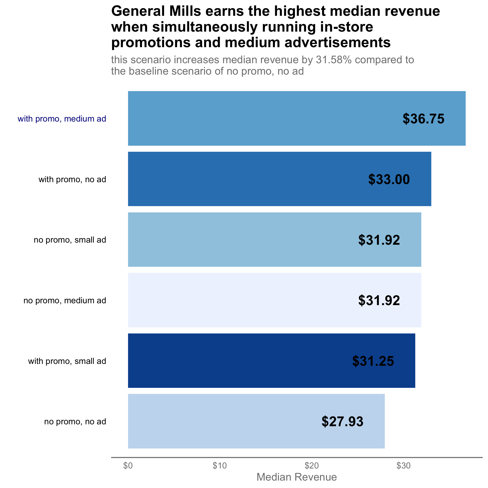
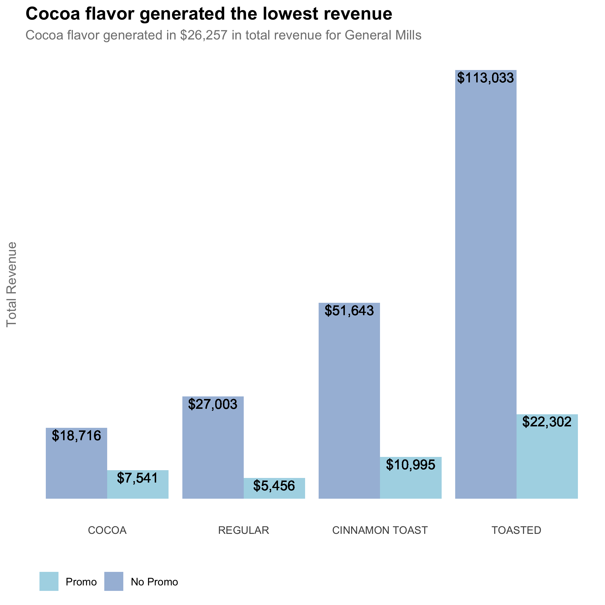
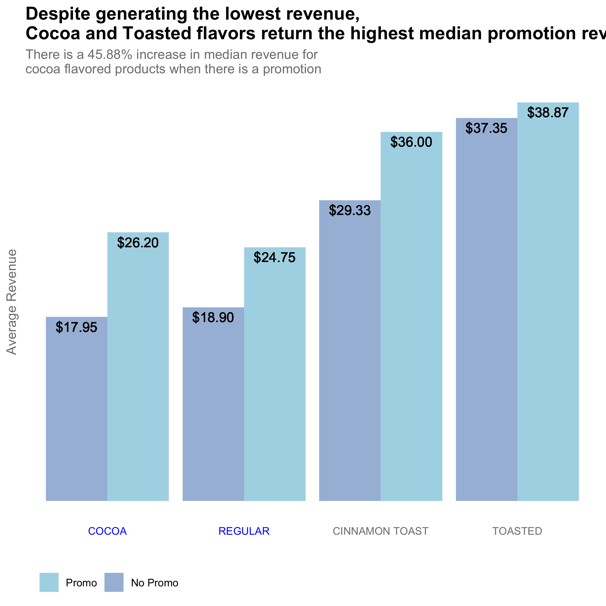

```{r echo = FALSE}
# Course: 5210 Data Vis
# Purpose: Slides for QuickProject2 presentation
# Date: August 12, 2021
# Author: Jennifer Grosz

```

```{r echo = FALSE}
# Clear environment of variables and functions
rm(list = ls(all = TRUE)) 

# Clear environment of packages
if(is.null(sessionInfo()$otherPkgs) == FALSE)lapply(paste("package:", names(sessionInfo()$otherPkgs), sep=""), detach, character.only = TRUE, unload = TRUE)

```

```{r echo = FALSE, message = FALSE}
# Load packages
library(tidyverse)

```


Understanding Ad & Promo Performance {.smaller}
===============================================

<div style="float: center; width: 100%">

<br>

This presentation will walk you through the significant findings uncovered in an analysis of General Mills' sales performance relative to the ongoing promotion and advertising programs.

<br>

Understanding the effectiveness of General Mills' advertising and promotion programs is key for determining deployment strategies of these programs moving forward.

<br>

{width=24%}

</div>


Revenue Generated from Promotion and Advertisement Scenarios {.smaller}
===============================================

<div style="float: left; width: 90%;">
 
 {width=60%}

</div>

Recommendation 1: {.smaller}
===============================================

<div style="float: center; width: 100%;">

The least effective advertisement and promo scenarios are:

+ In-store promotion with a small advertisement 

+ No promotion with a medium advertisement 

+ No promotion with a small advertisement

It would be my recommendation for General Mills to consider discontinuing small advertisements completely. Even when accompanied with an in-store promotion, small advertisements result in the smallest increase in average sales revenue. This scenario yeilds only a 12% increase in average revenue compared to the baseline scenario of no in-store promotion or advertisement of either size. 

It would also be my suggestion to discontinue advertising when there is not simultaneously an in-store promotion. Advertising without a promotion results in only a 14.29% increase in average sales revenue.

 </div>
 
General Mills Promotions - Revenue by Flavor {.smaller}
===============================================

<div style="float: center; width: 99%;">

 </div>

<div style="float: left; width: 50%;">

{width=90%}

 </div>

<div style="float: left; width: 50%;">


 {width=90%} 

</div>

Recommendation 2:  {.smaller}
===============================================

<div style="float: center; width: 100%;">

General Mills' promotions are least effective on Toasted flavored products. Since Toasted flavored products have the highest without any promotions, it is my recommendation to stop or reduce promotions for these products.

On the other hand, Cocoa and Cinnamon Toast flavors benefit the most from running in-store promotions. As such, it is my recommendation to continue running in-store promotions for these products.
