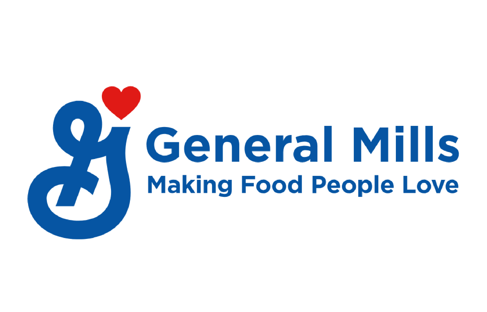

```{r echo = FALSE}
# Course: 5210 Data Vis
# Purpose: Slides for QuickProject2 presentation
# Date: August 12, 2021
# Author: Jennifer Grosz

```

```{r echo = FALSE}
# Clear environment of variables and functions
rm(list = ls(all = TRUE)) 

# Clear environment of packages
if(is.null(sessionInfo()$otherPkgs) == FALSE)lapply(paste("package:", names(sessionInfo()$otherPkgs), sep=""), detach, character.only = TRUE, unload = TRUE)

```

```{r echo = FALSE, message = FALSE}
# Load packages
library(tidyverse)

```


Understanding the competitive landscape {.smaller}
===============================================

<div style="float: center; width: 100%">

+ This presentation will walk you through the significant findings uncovered in an analysis of General Mills' sales performance relative to two competing brands: 

   - Kelloggs 
   
   - Post

+ Understanding General Mills' competitive standing is important because consumers are likely looking at all three brand’s products when making their purchasing decisions.

<br>

{width=24%}

</div>


Average Revenue for Promotion and Advertisement Scenarios {.smaller}
===============================================

<div style="float: left; width: 90%;">


 {width=75%}
 

When looking at the performance averages, General Mills has the highest median revenue for every scenario except when there are in-store promotions running simultaneously with small advertisements. In this scenario Kelloggs brings in a higher median revenue than General Mills. 

</div>

Recommendation 1: Product Pricing {.smaller}
===============================================

<div style="float: center; width: 100%;">

When there are in-store promotions and small advertisements concurrently being presented to consumers, General Mills could re-evaluate their product pricing strategy. One of the reasons behind why Kelloggs might be generating a higher average revenue than General Mills in this scenario could be attributed to the higher average price Kelloggs charges for their products in this scenario. This is the only scenario where Kelloggs charges an average product price that's higher than General Mills.


 </div>

<div style="float: left; width: 49%;">

{width=99%} 

 </div>

Recommendation 2: Store Frequency {.smaller}
===============================================

<div style="float: center; width: 99%;">


Running promotions and displaying small ads in more stores than General Mills could be another reason driving Kellogg's higher annual and average revenues. The two graphs below show the number of stores each brand ran promotions and displayed advertisements in last year.

 </div>

<div style="float: left; width: 50%;">

{width=99%}

 </div>

<div style="float: left; width: 50%;">

 {width=99%} 

</div>
